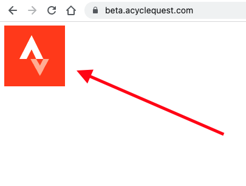
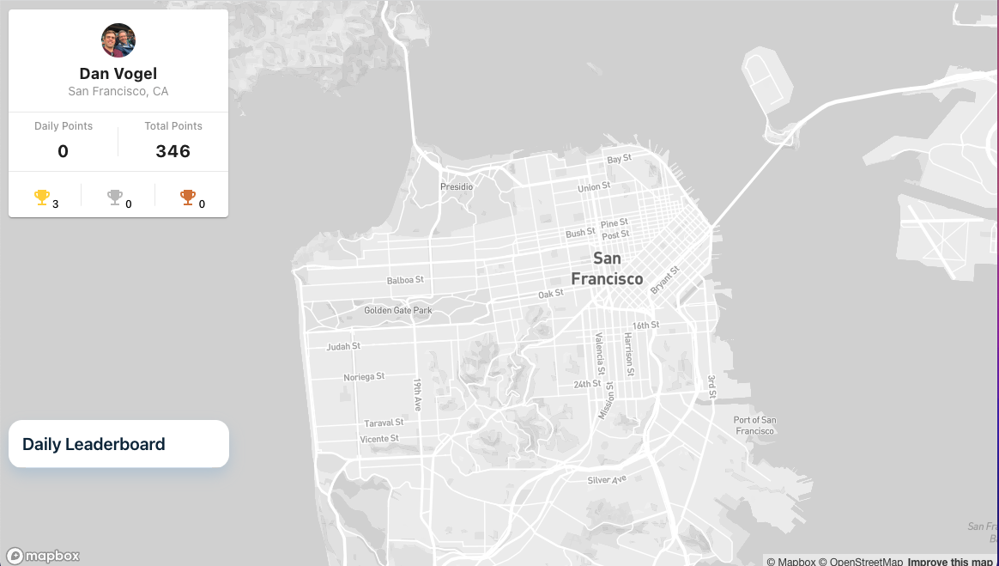
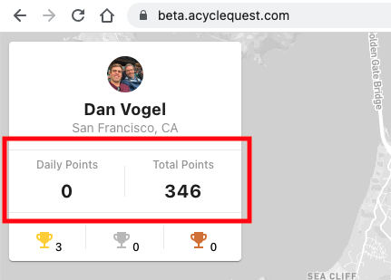
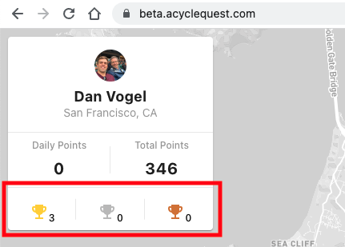
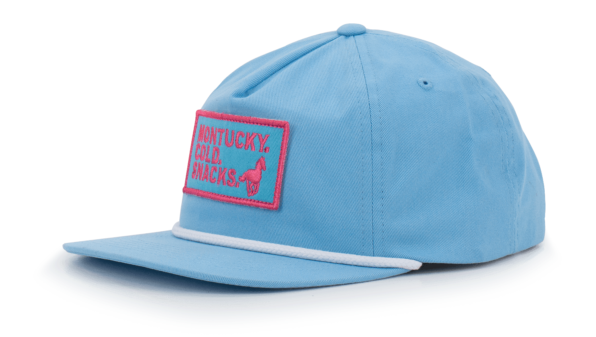

CycleQuest is a social exercise game where real-world workouts earn you
real rewards and bragging rights over your friends.

Do you ever talk smack with your fit friends about who can run, bike, or swim
more, and wish that your friends would just shut up and put their money where their mouth is? With CycleQuest, there are no excuses. Just friendly
competition.

## Cool, how does it work?

1. Go to http://beta.acyclequest.com

2. Log in by pressing the Strava Button. This will let CycleQuest pull your
   profile and workout information from Strava. (Note: if you don't have a
   Strava account, you will need to create one for this to work).

   > 

3. If Strava auth is successful, you should see a map view of SF with the
   athlete card in the upper left hand corner and the daily leaderboard in the
   bottom left hand corner.

   > 

4. If you recorded a workout on Strava earlier in the day, that workout route
   will be displayed on the map and points for that workout will automatically
   be calculated and added to your point totals.

### What are "points"?

Once logged in, you should see your athlete profile card in the upper left
hand corner.

> 

- **Daily Points** are your points earned on the current day
- **Total Points** is every point you have ever earned on CycleQuest

Points are awarded using the following formula:

- **1 Point** for each mile traveled (rounding down to nearest mile)
- **1 Point** for each 100 feet in elevation ascended (rounding down to nearest
  100 feet)

At the end of each day, trophies (gold/silver/bronze) are awarded to the top 3
point getters and daily points are reset.

## What are trophies?

The trophy row on the athlete card indicates how many times you've won each
kind of trophy.

> 

## The WBCC Challenge

If you are reading this, you are likely part of the Wide Bodies Cycling Club.
And I issue this challenge to you:

- **Gold Trophies** are 3 "trophy points"
- **Silver Trophies** are 2 "trophy points"
- **Bronze Trophies** are 1 "trophy point"

The competitor with the most trophy points from **1/23/22 - 2/23/22** wins
a brand new [Montucky Cold Snacks](https://montuckycoldsnacks.com/collections/all/products/who-doesnt-like-a-blue-and-pink-combo) hat from yours truly:

> 

May the odds be ever in your favor.
